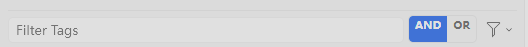

# Zotero Tag Logic

Adds **AND / OR / NOT** logic to Zotero's Tag Selector. An `AND | OR` toggle sits next to the filter box
(also available as *Match Any Selected Tag (OR)* in the Tag Selector's settings menu).



Every selected tag has one of three roles:

| Role | Meaning | How to set | Looks like |
|---|---|---|---|
| **MUST** | item must have this tag | click (AND mode) / Ctrl+click (OR mode) | native selected tag |
| **ANY** | item must have at least one of the ANY tags | click (OR mode) / Ctrl+click (AND mode) | blue outline, `∪` |
| **NOT** | item must have none of the NOT tags | Alt+click | red, struck through |

Result: `(ANY OR ANY …) AND MUST AND MUST … AND NOT NOT …` — e.g. `(ECG OR EEG) AND FPGA AND NOT BCI`.

- Clicking a selected tag with the same modifier again deselects it; with a different modifier it changes its role.
- The `AND | OR` toggle sets what a plain click means. Tags you never gave an explicit role follow it.
- While ANY/NOT are in use the tag list keeps showing the other tags in scope, so you can keep adding. The current
  filter is shown as text in the toggle's tooltip and at the top of the Tag Selector settings menu.
- Mode is saved in the pref `extensions.zotero-tag-logic.mode` and survives restarts.
- Nothing is written to the Zotero database and no saved search is created.

Target: Zotero 8–10 (developed against 10.0.5).

## How it works

`Zotero.CollectionTreeRow.getSearchObject()` normally ANDs every selected tag into the items search.
When the selection needs more than that, the plugin builds the same search without tags, then scopes a second
unsaved `Zotero.Search` to it: `tag is` for MUST, `tag isNot` for NOT and one condition group
`( tag A OR tag B OR ... )` for ANY. `getTags()` is patched to read from the tag-less scope while ANY/NOT are in use. Patches are removed when the plugin is disabled.

## Install

Download the `.xpi` from the [Releases](../../releases) page, then in Zotero:
Tools → Plugins → gear icon → *Install Plugin From File…*.

## Build from source

```
python build.py   # writes dist/zotero-tag-logic-<version>.xpi
```

## Debugging

`Zotero.TagLogic.mode`, `Zotero.TagLogic.setMode('or' | 'and')` are available from Tools → Developer → Run JavaScript.

## License

MIT
